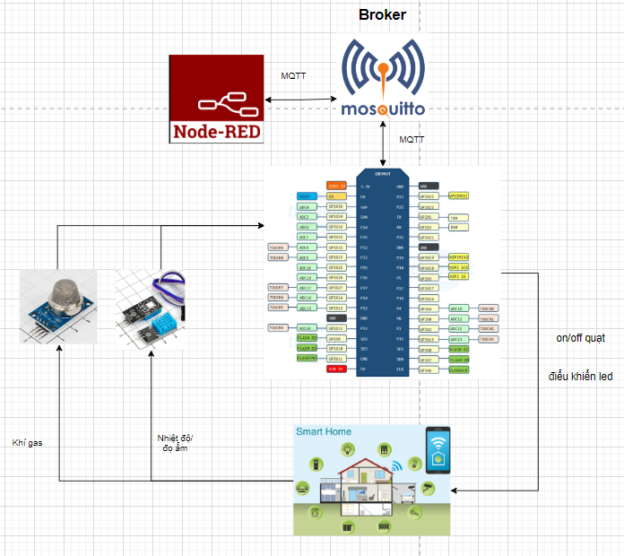
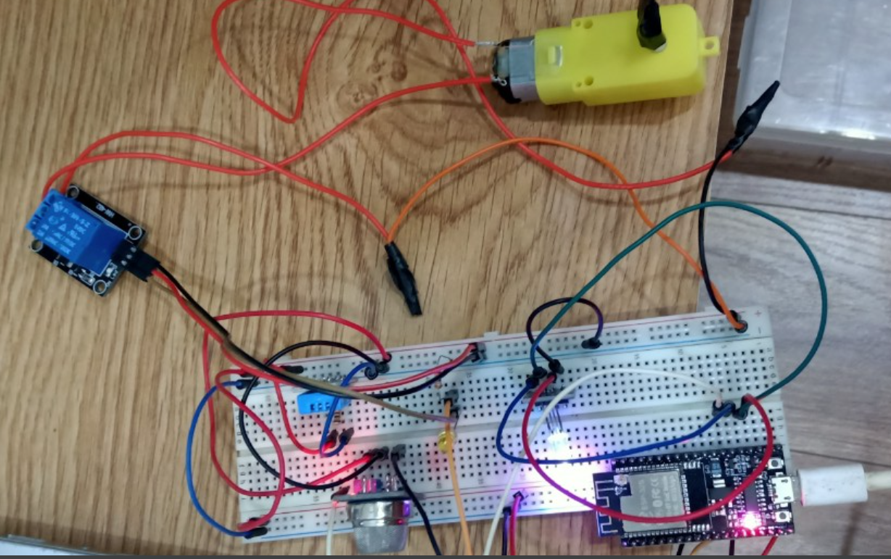
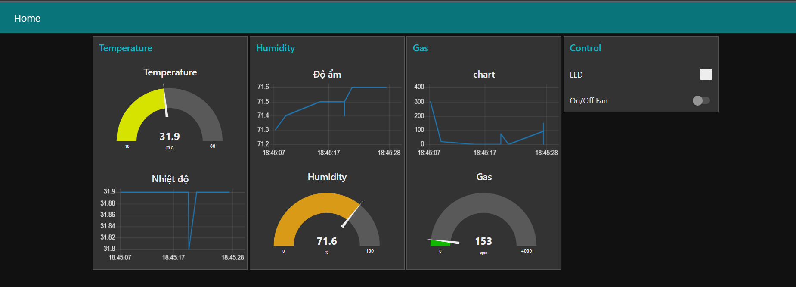

# Smart Home IOT
Bài tâp lớn thiết kế và phát triển ứng dụng IOT HK231 HCMUT

## Công nghệ sử dụng

- **Broker:** Eclipse Mosquitto
- **Client:** Node-RED, ESP32 

## Cài đặt

- tạo file credentials.h 

```
const char* ssid     = "<wifi>";
const char* password = "<password_wifi>";

const char *mqtt_server = "<ip_address>"; 
const char *mqtt_user = "<userMQTT>";
const char *mqtt_password = "<passwordMQTT>";
const int mqtt_port = 1883;
```

- [mở port 1883 trên local](./fixbug/phu_luc_IOT.pdf)

## Kết quả 
- Ý tưởng

- Mạch thực tế

- Giao diện ứng dụng


## Contact
* **Email**: hau.nguyenbk8786@gmail.com